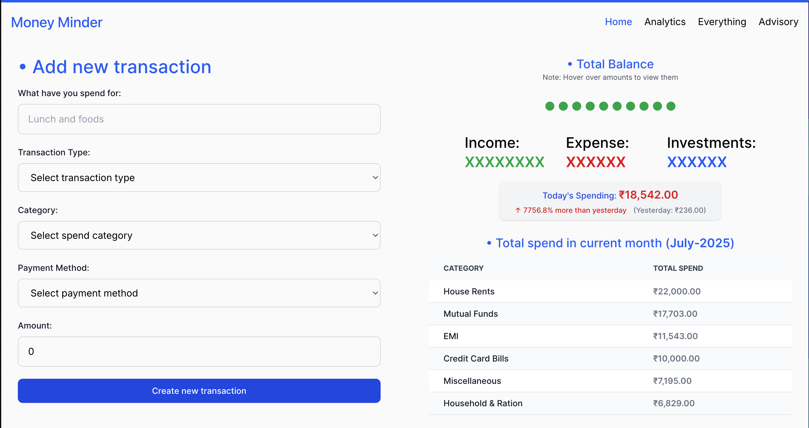

# Money Minder

> Work is in progress

Money Minder is a personal finance management application that helps users track their expenses and income. Built with Vue.js, it features a password-protected interface, transaction management, and balance tracking. The application allows users to categorize transactions, view detailed transaction history, and monitor their financial status through an intuitive dashboard. It's designed to be self-hosted, giving users complete control over their financial data.

## Techstack:

### Frontend
- Vue.js 3 with Composition API
- Tailwind CSS for styling
- Pinia for state management
- Vue Router for navigation
- Chart.js or D3.js for Charts (TODO)

### Backend
- Golang (net/http) server
- Native and handwritten middlewares
- RESTful API architecture

### Cloud Infrastructure
- Google Cloud Platform (GCP)
  - Cloud Run for containerized application hosting
  - Cloud Storage for static assets
  - BigQuery for analytics and reporting
  - Cloud Monitoring for observability

### Data Analytics
- BigQuery for financial data analysis
- Custom SQL queries for transaction insights
- Data visualization using BigQuery ML
- Automated reporting and trend analysis

## Frontend (Vue) -

### Password Protect Site:

### Home view:

### All transactions:

### Author Information
- **Name:** Sounish Nath
- **GitHub:** [github.com/sounishnath003](https://github.com/sounishnath003)
- **LinkedIn:** [linkedin.com/in/sounishnath](https://linkedin.com/in/sounishnath)