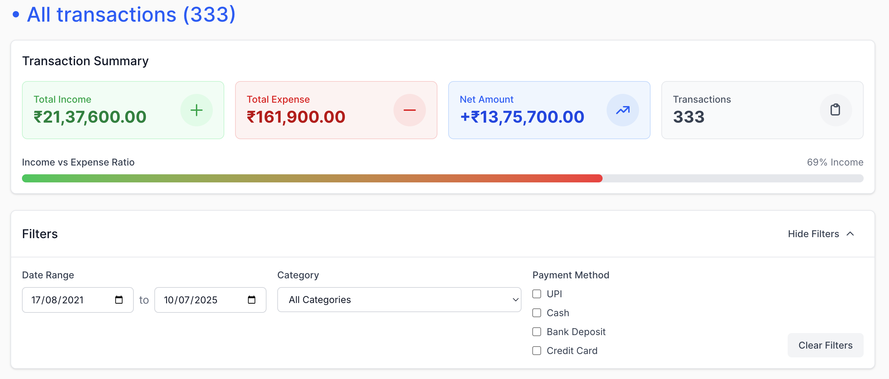
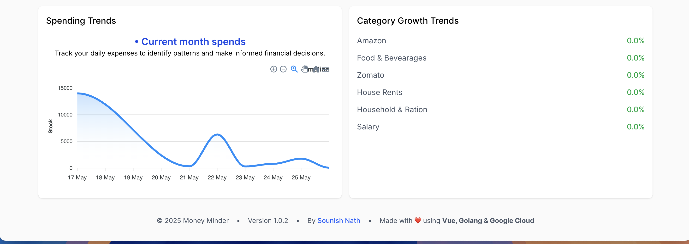

# Money Minder

Money Minder is a personal finance management application that helps users track their expenses and income. Built with Vue.js, it features a password-protected interface, transaction management, and balance tracking. The application allows users to categorize transactions, view detailed transaction history, and monitor their financial status through an intuitive dashboard. It's designed to be self-hosted, giving users complete control over their financial data.

## Techstack:

### Frontend
- Vue.js 3 with Composition API
- Tailwind CSS for styling
- Pinia for state management
- Vue Router for navigation

## Frontend (Vue) -

### Password Protect Site:


### Home view:


### Backend
- Golang (net/http) server
- Native and handwritten middlewares
- RESTful API architecture

### Cloud Infrastructure
- Google Cloud Platform (GCP)
  - Cloud Run for containerized application hosting
  - Cloud Storage for static assets
  - BigQuery for analytics and reporting
  - Cloud Monitoring for observability

### All transactions:

Transactions - 1


Transactions - 2


### Data Analytics
- BigQuery for financial data analysis
- Custom SQL queries for transaction insights
- Data visualization using BigQuery ML
- Automated reporting and trend analysis

### Analytics Section - 1:


### Analytics Section - 2:


### Analytics Section - 3:


## Everything Section 

Look back your expenses Year by year and MoM drill down.

### Intellegent Summary Cards:


### Compare your expenses Month v/s Month:


## Local setup for Backend server:

Check the `.env.sample` file mentioned os environment variables.

```bash
export JWT_SECRET=$(LC_ALL=C tr -dc 'A-Za-z0-9!.*@#' </dev/urandom | head -c 48)
export SITE_SECRET_PUBLIC_KEY=
export SITE_SECRET_PRIVATE_KEY=

make run-backend 
```

## Local setup for Frontend app:

Check the `web/.env.sample` file mentioned os environment variables.
Actually you would need 3 different environment `.env` files
- .env.sample
- .env.dev
- .env.prod

```bash
make frontend-run-dev
```

## For Production Deployments:

I am using `Google Cloud Platform` to self host my service. What i do generally.

```bash
export JWT_SECRET=$(LC_ALL=C tr -dc 'A-Za-z0-9!.*@#' </dev/urandom | head -c 48)
export SITE_SECRET_PUBLIC_KEY=
export SITE_SECRET_PRIVATE_KEY=

make deploy-all
```

Note: In future, I might introduce the .`@cloud/build` to automated. But I do not require it currently. The cloud build service is the platform services for developer tools in GCP.

## TODO:
- Create the migration script for the BigQuery.
- Configuration as Code using Go.
- Easily clone and setup your personal service.

## Author Information
- **Name:** Sounish Nath
- **GitHub:** [github.com/sounishnath003](https://github.com/sounishnath003)
- **LinkedIn:** [linkedin.com/in/sounishnath](https://linkedin.com/in/sounishnath)